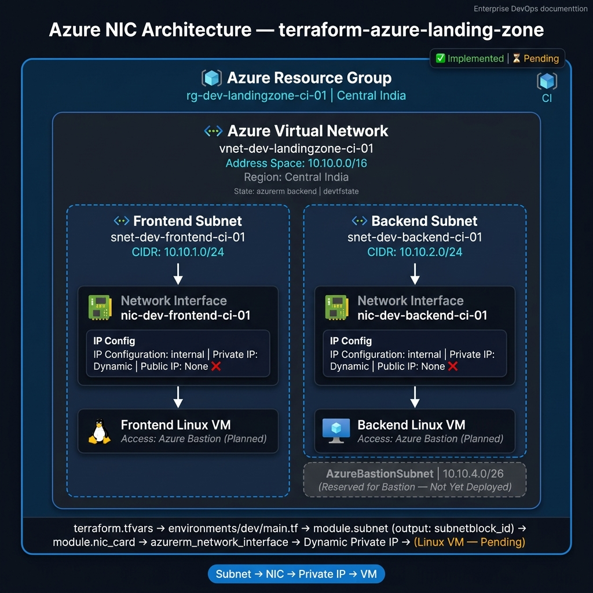

# terraform-azure-landing-zone

Production-ready Azure Landing Zone built with reusable Terraform modules on Microsoft Azure, following Infrastructure as Code (IaC) best practices.

> **Cloud Provider:** Microsoft Azure  
> **IaC Tool:** Terraform (azurerm `5.0.1`)  
> **Region:** Central India  
> **State Backend:** Azure Blob Storage (`devtfstate`)

---

## 🚀 Current Progress

### ✅ Implemented
- [x] Repository Structure
- [x] Initial Azure Landing Zone Architecture Diagram
- [x] Reusable Azure Resource Group Module
- [x] Virtual Network Module
- [x] Subnet Module (multi-subnet via `for_each`)
- [x] Public IP Module (provisioned for future Bastion / NAT Gateway use)
- [x] Network Interface (NIC) Module
- [x] Frontend NIC — `nic-dev-frontend-ci-01` (Dynamic private IP, no public IP)
- [x] Backend NIC — `nic-dev-backend-ci-01` (Dynamic private IP, no public IP)

### ⏳ Pending
- [ ] Network Security Group (NSG) Module
- [ ] Linux Virtual Machine Module (Frontend & Backend)
- [ ] Azure Bastion Module
- [ ] NAT Gateway Module
- [ ] Load Balancer Module
- [ ] Application Gateway Module
- [ ] Storage Account Module
- [ ] Azure Key Vault Module
- [ ] Log Analytics Workspace Module
- [ ] Azure Monitor Module
- [ ] Azure DevOps CI/CD Pipeline

> **Note:** PostgreSQL VM has been removed from the architecture. The database layer will use **Azure Database for PostgreSQL Flexible Server** in a future sprint.

---

## 📐 Solution Architecture



> **Current diagram** shows the implemented NIC architecture.  
> See [`architecture/diagrams/azure-landing-zone-architecture.drawio`](architecture/diagrams/azure-landing-zone-architecture.drawio) for the full planned landing zone architecture.

---

## 🌐 Networking — Current Implementation

### Azure Virtual Network

| Property | Value |
|---|---|
| Name | `vnet-dev-landingzone-ci-01` |
| Address Space | `10.10.0.0/16` |
| Region | Central India |
| Resource Group | `rg-dev-landingzone-ci-01` |

### Subnets

| Key | Subnet Name | CIDR | Purpose |
|---|---|---|---|
| `subnet1` | `AzureBastionSubnet` | `10.10.4.0/26` | Reserved — Bastion (not yet deployed) |
| `subnet2` | `snet-dev-frontend-ci-01` | `10.10.1.0/24` | Frontend Linux VM |
| `subnet3` | `snet-dev-backend-ci-01` | `10.10.2.0/24` | Backend Linux VM |

### Network Interfaces (NICs)

| NIC Name | Subnet | IP Configuration | Private IP | Public IP |
|---|---|---|---|---|
| `nic-dev-frontend-ci-01` | `snet-dev-frontend-ci-01` | `internal` | Dynamic | **None** |
| `nic-dev-backend-ci-01` | `snet-dev-backend-ci-01` | `internal` | Dynamic | **None** |

Both NICs use **Dynamic private IP allocation** with **no public IP attached**.  
Frontend and Backend VMs will be accessed privately via **Azure Bastion** (planned).

---

## 🔗 Terraform Module Dependency Flow

```
terraform.tfvars
      │
      ▼
environments/dev/main.tf
      │
      ├──► module.resource_group   ──► azurerm_resource_group
      │
      ├──► module.Virtual_Network  ──► azurerm_virtual_network
      │         (depends_on: resource_group)
      │
      ├──► module.subnet           ──► azurerm_subnet (for_each)
      │         (depends_on: Virtual_Network)
      │         output: subnetblock_id["subnet2"], ["subnet3"]
      │
      ├──► module.public_ip_address_id ──► azurerm_public_ip (for_each)
      │         (pip-bastion, pip-nat-gateway — not yet attached)
      │
      └──► module.nic_card         ──► azurerm_network_interface (for_each)
                (depends_on: subnet)
                frontend subnet_id ◄── module.subnet.subnetblock_id["subnet2"]
                backend  subnet_id ◄── module.subnet.subnetblock_id["subnet3"]
```

---

## 📁 Folder Structure

```
terraform-azure-landing-zone/
├── architecture/
│   └── diagrams/
│       ├── azure-landing-zone-architecture.drawio   # Full planned architecture
│       ├── azure-landing-zone-architecture.png      # Full planned architecture PNG
│       └── azure-nic-architecture.png               # Current NIC implementation
├── docs/
│   ├── project-overview.md
│   ├── deployment-guide.md
│   └── troubleshooting.md
├── environments/
│   └── dev/
│       ├── backend.tf
│       ├── main.tf
│       ├── outputs.tf
│       ├── provider.tf
│       ├── terraform.tfvars
│       └── variables.tf
├── modules/
│   ├── azurerm_resource_group/
│   ├── azurerm_virtual_network/
│   ├── azurerm_subnet/
│   ├── azurerm_public_ip/
│   ├── azurerm_network_interface/
│   ├── azurerm_network_security_group/   # Module exists — not yet wired
│   ├── azurerm_linux_virtual_machine/    # Module exists — not yet wired
│   ├── azurerm_bastion_host/             # Module exists — not yet wired
│   ├── azurerm_nat_gateway/              # Module exists — not yet wired
│   ├── azurerm_key_vault/                # Module exists — not yet wired
│   └── azurerm_storage_account/         # Module exists — not yet wired
├── pipelines/
└── scripts/
```

---

## 🏷️ Tags Applied to All Resources

| Tag | Value |
|---|---|
| `Environment` | `Development` |
| `Project` | `Azure Landing Zone` |
| `ManagedBy` | `Terraform` |
| `Owner` | `Santu Paira` |

---

## 🔧 Prerequisites

- Terraform `>= 1.x`
- Azure CLI authenticated (`az login`)
- Azure subscription with contributor access
- Remote state storage account pre-created: `state0files0stg0dev123`

---

## 📚 Documentation

| Document | Description |
|---|---|
| [Project Overview](docs/project-overview.md) | Architecture goals, sprint status |
| [Deployment Guide](docs/deployment-guide.md) | Step-by-step deployment instructions |
| [Troubleshooting](docs/troubleshooting.md) | Known issues and resolutions |

---

## 🌍 Technology Stack

| Tool | Purpose |
|---|---|
| Terraform | Infrastructure provisioning |
| Azure Resource Manager | Cloud provider |
| Azure Blob Storage | Remote Terraform state |
| AzureRM Provider `5.0.1` | Terraform Azure provider |
| Azure DevOps | CI/CD (planned) |