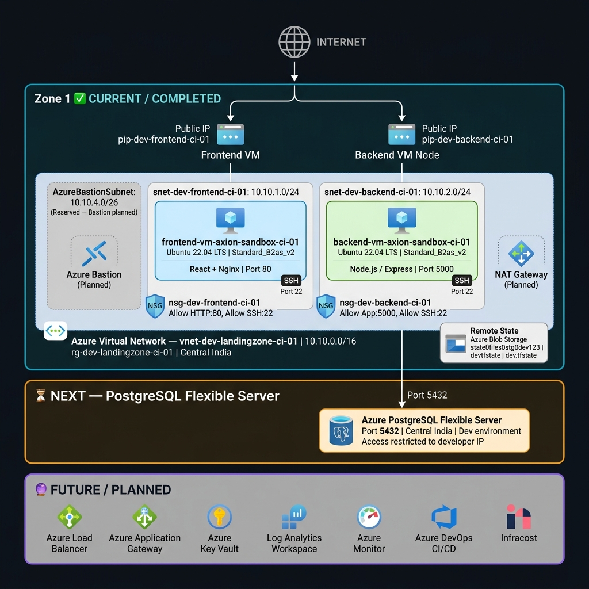
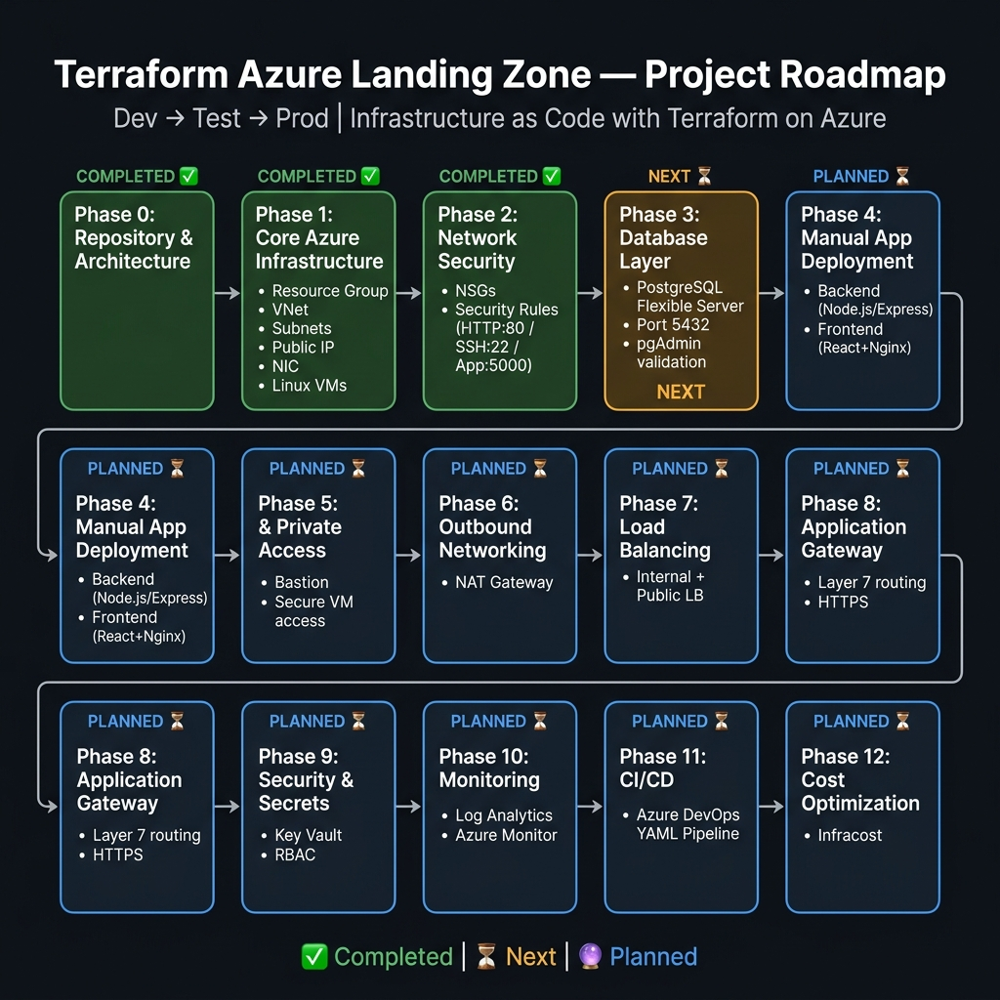

# 🏗️ Terraform Azure Landing Zone

> **Production-style 3-tier application infrastructure on Microsoft Azure, built with reusable Terraform modules, following Infrastructure as Code (IaC) best practices.**

[](https://www.terraform.io/)
[](https://registry.terraform.io/providers/hashicorp/azurerm/latest)
[](https://azure.microsoft.com/en-us/global-infrastructure/geographies/)
[]()

---

## Project Description

This project builds a **production-style Azure Landing Zone** using **Terraform Infrastructure as Code**. The infrastructure hosts a 3-tier web application — a **React + Nginx frontend**, a **Node.js/Express backend**, and **Azure Database for PostgreSQL Flexible Server** — all provisioned on Microsoft Azure using modular, reusable Terraform child modules.

The project follows **trunk-based development** with short-lived feature branches, PR-based merges into `main`, and a phased delivery approach starting with development before expanding to test and production.

---

## Project Objective

| Objective | Description |
|---|---|
| Infrastructure as Code | 100% Terraform-managed Azure infrastructure |
| Modular Architecture | One reusable child module per Azure resource type |
| 3-Tier Application | Frontend VM → Backend VM → PostgreSQL Flexible Server |
| Environment Parity | Dev → Test → Prod environment structure |
| Security-First | NSGs, Bastion, Key Vault, RBAC (phased rollout) |
| CI/CD Ready | Azure DevOps YAML pipeline (planned) |
| Cost Visibility | Infracost integration (planned) |

---

## Architecture Diagram

### Current Infrastructure



### Full Project Roadmap



> See also: [azure-landing-zone-architecture.drawio](architecture/diagrams/azure-landing-zone-architecture.drawio) for the original draw.io source.

---

## Current Architecture

The current **development environment** uses Public IPs on both VMs for SSH access and manual testing:

```
Internet
    |
    +-------------------------------+
    |                               |
Public IP (Frontend)        Public IP (Backend)
pip-dev-frontend-ci-01      pip-dev-backend-ci-01
    |                               |
    v                               v
Frontend NIC                Backend NIC
nic-dev-frontend-ci-01      nic-dev-backend-ci-01
    |                               |
    v                               v
+----------------------------------------------------------+
|  Azure VNet: vnet-dev-landingzone-ci-01 (10.10.0.0/16)  |
|  Resource Group: rg-dev-landingzone-ci-01                |
|  Region: Central India                                   |
|                                                          |
|  AzureBastionSubnet  10.10.4.0/26  (Reserved - Planned) |
|                                                          |
|  snet-dev-frontend-ci-01  10.10.1.0/24                  |
|  NSG: nsg-dev-frontend-ci-01                            |
|    frontend-vm-axion-sandbox-ci-01                       |
|    Ubuntu 22.04 LTS | Standard_B2as_v2                  |
|    React + Nginx | Port 80                               |
|                                                          |
|  snet-dev-backend-ci-01   10.10.2.0/24                  |
|  NSG: nsg-dev-backend-ci-01                             |
|    backend-vm-axion-sandbox-ci-01                        |
|    Ubuntu 22.04 LTS | Standard_B2as_v2                  |
|    Node.js / Express | Port 5000                         |
+----------------------------------------------------------+
                    |
                    v  (NEXT)
    Azure Database for PostgreSQL Flexible Server
                  Port 5432
```

> **Note:** Public IPs on VMs are used **only during development/testing** for SSH and manual validation. Azure Bastion will replace direct SSH in a future phase.

> **Note:** A PostgreSQL VM is **not part of this architecture**. The database layer uses **Azure Database for PostgreSQL Flexible Server** (PaaS) — the next planned feature.

---

## Technology Stack

| Tool / Service | Purpose | Status |
|---|---|---|
| Terraform | Infrastructure provisioning (IaC) | Done |
| AzureRM Provider 5.0.1 | Terraform Azure provider | Done |
| Microsoft Azure | Cloud platform | Done |
| Azure Blob Storage | Remote Terraform state backend | Done |
| Ubuntu 22.04 LTS | Linux VM OS (Frontend and Backend) | Done |
| React + Nginx | Frontend application stack | Planned deployment |
| Node.js / Express | Backend application stack (Port 5000) | Planned deployment |
| Azure PostgreSQL Flexible Server | Managed database (PaaS) | Next |
| Azure Bastion | Secure VM access | Planned |
| NAT Gateway | Outbound connectivity | Planned |
| Azure Load Balancer | Traffic distribution | Planned |
| Azure Application Gateway | Layer 7 routing / WAF | Planned |
| Azure Key Vault | Secret management | Planned |
| Log Analytics Workspace | Centralized logging | Planned |
| Azure Monitor | Observability and alerting | Planned |
| Azure DevOps | CI/CD pipelines | Planned |
| Infracost | Terraform cost estimation | Planned |

---

## Repository Structure

```
terraform-azure-landing-zone/
|
+-- architecture/
|   +-- diagrams/
|   |   +-- azure-landing-zone-architecture.drawio
|   |   +-- azure-landing-zone-architecture.png
|   |   +-- azure-nic-architecture.png
|   |   +-- terraform-azure-landing-zone-architecture.png
|   |   +-- terraform-azure-landing-zone-roadmap.png
|   +-- screenshots/
|
+-- docs/
|   +-- project-overview.md
|   +-- deployment-guide.md
|   +-- troubleshooting.md
|
+-- environments/
|   +-- dev/                    Active - current development environment
|   |   +-- backend.tf          Azure Blob Storage remote state config
|   |   +-- main.tf             Module wiring (root composition)
|   |   +-- outputs.tf          Output values
|   |   +-- provider.tf         AzureRM provider config
|   |   +-- terraform.tfvars    Dev environment variable values
|   |   +-- variables.tf        Variable declarations
|   +-- test/                   Planned
|   +-- prod/                   Planned
|
+-- modules/
|   +-- azurerm_resource_group/          Implemented and Used
|   +-- azurerm_virtual_network/         Implemented and Used
|   +-- azurerm_subnet/                  Implemented and Used
|   +-- azurerm_public_ip/               Implemented and Used
|   +-- azurerm_network_interface/       Implemented and Used
|   +-- azurerm_linux_virtual_machine/   Implemented and Used
|   +-- azurerm_network_security_group/  Implemented and Used
|   +-- azurerm_storage_account/         Placeholder - not yet implemented
|   +-- azurerm_bastion_host/            Placeholder - not yet implemented
|   +-- azurerm_nat_gateway/             Placeholder - not yet implemented
|   +-- azurerm_key_vault/               Placeholder - not yet implemented
|
+-- pipelines/
|   +-- azure-pipelines.yml     Placeholder - CI/CD not yet implemented
|
+-- scripts/
|   +-- deploy-demo-app.sh
|   +-- install-nginx.sh
|
+-- .gitignore
+-- README.md
```

---

## Environment Structure

```
environments/
+-- dev/    Active  - current development environment (Central India)
+-- test/   Planned - future test environment
+-- prod/   Planned - future production environment
```

The **development environment** is the current focus. Once stable and validated, the roadmap expands to **test** and **prod**.

---

## Terraform Module Structure

| Module | Resource Type | Status | Notes |
|---|---|---|---|
| azurerm_resource_group | azurerm_resource_group | Done | main.tf, variables.tf, outputs.tf |
| azurerm_virtual_network | azurerm_virtual_network | Done | main.tf, variables.tf, outputs.tf |
| azurerm_subnet | azurerm_subnet | Done | for_each multi-subnet support |
| azurerm_public_ip | azurerm_public_ip | Done | for_each multi-PIP support |
| azurerm_network_interface | azurerm_network_interface | Done | Frontend + Backend NICs |
| azurerm_linux_virtual_machine | azurerm_linux_virtual_machine | Done | Frontend + Backend VMs |
| azurerm_network_security_group | azurerm_network_security_group | Done | Dynamic security rules |
| azurerm_storage_account | azurerm_storage_account | Placeholder | Empty folder |
| azurerm_bastion_host | azurerm_bastion_host | Placeholder | Empty folder |
| azurerm_nat_gateway | azurerm_nat_gateway | Placeholder | Empty folder |
| azurerm_key_vault | azurerm_key_vault | Placeholder | Empty folder |

**Planned modules (no folder yet):**
- azurerm_postgresql_flexible_server — Next
- azurerm_load_balancer — Planned
- azurerm_application_gateway — Planned
- azurerm_log_analytics — Planned
- azurerm_monitor — Planned

---

## Current Status

| Item | Status |
|---|---|
| Repository structure | Done |
| Architecture directory | Done |
| Development environment structure | Done |
| Terraform provider configuration (AzureRM 5.0.1) | Done |
| Remote state backend (Azure Blob Storage) | Done |
| Terraform variables / tfvars structure | Done |
| Resource Group module | Done |
| Azure Virtual Network module | Done |
| Azure Subnet module | Done |
| Azure Public IP module | Done |
| Azure Network Interface module | Done |
| Azure Linux Virtual Machine module | Done |
| Frontend Linux VM - frontend-vm-axion-sandbox-ci-01 | Done |
| Backend Linux VM - backend-vm-axion-sandbox-ci-01 | Done |
| NIC to VM dependency and output wiring | Done |
| Public IP to NIC attachment (Frontend and Backend) | Done |
| VM SKU validation for Central India (Standard_B2as_v2) | Done |
| Network Security Group module | Done |
| Frontend NSG - HTTP:80, SSH:22 | Done |
| Backend NSG - App Port:5000, SSH:22 | Done |
| Trunk-based Git workflow | Done |
| Feature branch development workflow | Done |
| Pull Request and merge workflow | Done |
| Terraform plan / apply validation | Done |
| Azure PostgreSQL Flexible Server | NEXT |
| PostgreSQL database configuration | Next |
| Database firewall configuration | Next |
| Backend application deployment | Planned |
| Frontend application deployment | Planned |
| Nginx deployment | Planned |
| Azure Bastion | Planned |
| NAT Gateway | Planned |
| Load Balancer | Planned |
| Application Gateway | Planned |
| Key Vault | Planned |
| Log Analytics | Planned |
| Azure Monitor | Planned |
| CI/CD Pipeline (Azure DevOps) | Planned |
| Infracost | Planned |

---

## Networking Overview

### Azure Virtual Network

| Property | Value |
|---|---|
| Name | vnet-dev-landingzone-ci-01 |
| Address Space | 10.10.0.0/16 |
| Region | Central India |
| Resource Group | rg-dev-landingzone-ci-01 |

### Subnets

| Key | Subnet Name | CIDR | Purpose | Status |
|---|---|---|---|---|
| subnet1 | AzureBastionSubnet | 10.10.4.0/26 | Reserved for Azure Bastion | Created (Bastion Planned) |
| subnet2 | snet-dev-frontend-ci-01 | 10.10.1.0/24 | Frontend Linux VM | Active |
| subnet3 | snet-dev-backend-ci-01 | 10.10.2.0/24 | Backend Linux VM | Active |

> The `AzureBastionSubnet` name is mandatory for Azure Bastion. It is pre-created and reserved. Azure Bastion itself will be deployed in a future phase.

### Public IPs

| Resource | Name | Allocation | Purpose |
|---|---|---|---|
| pip-frontend | pip-dev-frontend-ci-01 | Static | Attached to Frontend NIC |
| pip-backend | pip-dev-backend-ci-01 | Static | Attached to Backend NIC |

### Network Interfaces (NICs)

| NIC Name | Subnet | Private IP | Public IP | VM |
|---|---|---|---|---|
| nic-dev-frontend-ci-01 | snet-dev-frontend-ci-01 | Dynamic | pip-dev-frontend-ci-01 | frontend-vm-axion-sandbox-ci-01 |
| nic-dev-backend-ci-01 | snet-dev-backend-ci-01 | Dynamic | pip-dev-backend-ci-01 | backend-vm-axion-sandbox-ci-01 |

### Terraform Module Dependency Flow

```
terraform.tfvars
      |
      v
environments/dev/main.tf
      |
      +---> module.resource_group        ---> azurerm_resource_group
      |
      +---> module.Virtual_Network       ---> azurerm_virtual_network
      |         (depends_on: resource_group)
      |
      +---> module.subnet                ---> azurerm_subnet (for_each - 3 subnets)
      |         (depends_on: Virtual_Network)
      |
      +---> module.public_ip_address_id  ---> azurerm_public_ip (for_each - pip-frontend, pip-backend)
      |         (depends_on: resource_group)
      |
      +---> module.nic_card              ---> azurerm_network_interface (for_each - frontend, backend)
      |         (depends_on: subnet)
      |         frontend <- subnetblock_id["subnet2"] + pip["pip-frontend"]
      |         backend  <- subnetblock_id["subnet3"] + pip["pip-backend"]
      |
      +---> module.nsg                   ---> azurerm_network_security_group (for_each - frontend, backend)
      |         (depends_on: resource_group)
      |
      +---> module.vms                   ---> azurerm_linux_virtual_machine (for_each - vm1, vm2)
                (depends_on: subnet, public_ip_address_id)
                vm1 (frontend) <- nic_card_dev["frontend"]
                vm2 (backend)  <- nic_card_dev["backend"]
```

---

## Virtual Machine Architecture

### Frontend VM

| Property | Value |
|---|---|
| Name | frontend-vm-axion-sandbox-ci-01 |
| Resource Group | rg-dev-landingzone-ci-01 |
| Location | Central India |
| VM Size | Standard_B2as_v2 |
| OS | Ubuntu Server 22.04 LTS (Canonical) |
| OS Image | Canonical:0001-com-ubuntu-server-jammy:22_04-lts:latest |
| Disk | Standard LRS, ReadWrite cache |
| NIC | nic-dev-frontend-ci-01 |
| Public IP | pip-dev-frontend-ci-01 |
| Subnet | snet-dev-frontend-ci-01 (10.10.1.0/24) |
| Planned App | React + Nginx (Port 80) |

### Backend VM

| Property | Value |
|---|---|
| Name | backend-vm-axion-sandbox-ci-01 |
| Resource Group | rg-dev-landingzone-ci-01 |
| Location | Central India |
| VM Size | Standard_B2as_v2 |
| OS | Ubuntu Server 22.04 LTS (Canonical) |
| OS Image | Canonical:0001-com-ubuntu-server-jammy:22_04-lts:latest |
| Disk | Standard LRS, ReadWrite cache |
| NIC | nic-dev-backend-ci-01 |
| Public IP | pip-dev-backend-ci-01 |
| Subnet | snet-dev-backend-ci-01 (10.10.2.0/24) |
| Planned App | Node.js / Express (Port 5000) |

---

## Network Security Groups

NSGs are implemented using the `azurerm_network_security_group` module with dynamic security rule blocks.

### Frontend NSG - nsg-dev-frontend-ci-01

| Rule Name | Priority | Direction | Protocol | Port | Source | Action |
|---|---|---|---|---|---|---|
| Allow-HTTP | 100 | Inbound | TCP | 80 | Any | Allow |
| Allow-SSH | 110 | Inbound | TCP | 22 | Any | Allow |

### Backend NSG - nsg-dev-backend-ci-01

| Rule Name | Priority | Direction | Protocol | Port | Source | Action |
|---|---|---|---|---|---|---|
| Allow-Backend | 100 | Inbound | TCP | 5000 | Any | Allow |
| Allow-SSH | 110 | Inbound | TCP | 22 | Any | Allow |

> **Development phase only.** SSH from any source is used for initial manual testing. SSH hardening is planned in Phase 5.

---

## Tagging Strategy

| Tag Key | Tag Value |
|---|---|
| Environment | Development |
| Project | Azure Landing Zone |
| ManagedBy | Terraform |
| Owner | Santu Paira |

Tags are passed to all modules via `var.tags` in `terraform.tfvars`.

---

## State Management

| Property | Value |
|---|---|
| Backend type | azurerm (Azure Blob Storage) |
| Resource Group | rg-dev-Landing-Zone-project-1 |
| Storage Account | state0files0stg0dev123 |
| Container | devtfstate |
| State Key | dev.tfstate |
| Provider Version | hashicorp/azurerm 5.0.1 |

Remote state ensures team collaboration, state locking, and state history.

---

## Git Branching Strategy

This project follows **trunk-based development** with short-lived feature branches.

```
main (trunk)
  |
  +-- feature/resource-group          --- PR --> merge --> main
  +-- feature/virtual-network         --- PR --> merge --> main
  +-- feature/subnet                  --- PR --> merge --> main
  +-- feature/public-ip               --- PR --> merge --> main
  +-- feature/network-interface       --- PR --> merge --> main
  +-- feature/linux-vm                --- PR --> merge --> main
  +-- feature/network-security-group  --- PR --> merge --> main
  +-- feature/postgresql-flexible-server  (upcoming)
  +-- feature/<next-resource>         (future)
```

| Rule | Description |
|---|---|
| Short-lived branches | Each feature branch targets one resource type / module |
| PR-based merging | All changes require a Pull Request before merging to main |
| One module per branch | Each branch adds a single Terraform child module |
| No direct commits to main | All changes go through feature branches |
| Validation before merge | terraform plan validated before PR approval |

---

## Terraform Workflow

```bash
# 1. Navigate to the dev environment
cd environments/dev

# 2. Initialize Terraform
terraform init

# 3. Validate configuration
terraform validate

# 4. Preview changes
terraform plan

# 5. Apply infrastructure
terraform apply

# 6. Inspect outputs
terraform output
```

---

## Roadmap

| Phase | Description | Status |
|---|---|---|
| Phase 0 | Repository and Architecture | Done |
| Phase 1 | Core Azure Infrastructure (RG, VNet, Subnets, PIPs, NICs, VMs) | Done |
| Phase 2 | Network Security Groups | Done |
| Phase 3 | Azure Database for PostgreSQL Flexible Server | NEXT |
| Phase 4 | Manual Application Deployment (Backend + Frontend + Nginx) | Planned |
| Phase 5 | Azure Bastion and Private Access | Planned |
| Phase 6 | Outbound Networking (NAT Gateway) | Planned |
| Phase 7 | Load Balancing | Planned |
| Phase 8 | Application Gateway | Planned |
| Phase 9 | Security and Secrets (Key Vault, RBAC) | Planned |
| Phase 10 | Monitoring and Observability | Planned |
| Phase 11 | CI/CD (Azure DevOps) | Planned |
| Phase 12 | Cost Optimization (Infracost) | Planned |

### Phase 0 - Repository and Architecture (Done)

- [x] Repository initialization
- [x] Architecture diagrams
- [x] Development environment directory structure
- [x] Terraform provider configuration (AzureRM 5.0.1)
- [x] Remote state backend configuration (Azure Blob Storage)

### Phase 1 - Core Azure Infrastructure (Done)

- [x] Resource Group - rg-dev-landingzone-ci-01
- [x] Virtual Network - vnet-dev-landingzone-ci-01 (10.10.0.0/16)
- [x] Subnets - AzureBastionSubnet, Frontend, Backend
- [x] Public IPs - Frontend + Backend (Static)
- [x] Network Interfaces - Frontend NIC + Backend NIC (with Public IP attached)
- [x] Linux VM module (Ubuntu 22.04, Standard_B2as_v2)
- [x] Frontend VM - frontend-vm-axion-sandbox-ci-01
- [x] Backend VM - backend-vm-axion-sandbox-ci-01
- [x] NIC to VM dependency and output wiring
- [x] Terraform plan/apply validation

### Phase 2 - Network Security Groups (Done)

- [x] NSG module with dynamic security rule support
- [x] Frontend NSG - Allow HTTP:80, Allow SSH:22
- [x] Backend NSG - Allow App Port:5000, Allow SSH:22
- [x] NSG module wired in environments/dev/main.tf

### Phase 3 - Database Layer (NEXT)

> **This is the next infrastructure feature to be implemented.**

- [ ] Create modules/azurerm_postgresql_flexible_server/ Terraform module
- [ ] Azure Database for PostgreSQL Flexible Server (Central India, Dev)
- [ ] PostgreSQL port 5432
- [ ] Public Access mode (development/testing phase only)
- [ ] Firewall rule restricted to developer laptop/client IP
- [ ] Validate connection using pgAdmin
- [ ] Create application database
- [ ] Validate Backend VM to PostgreSQL connectivity on port 5432

### Phase 4 - Manual Application Deployment (Planned)

> To be started after Phase 3 (PostgreSQL) is validated.

**Backend Deployment:**
- [ ] SSH into Backend VM via Public IP
- [ ] Install Node.js and required dependencies
- [ ] Clone backend application repository
- [ ] Configure PostgreSQL connection string
- [ ] Start Node.js/Express backend application (port 5000)
- [ ] Validate backend application accessible on port 5000

**Frontend Deployment:**
- [ ] SSH into Frontend VM via Public IP
- [ ] Install Node.js
- [ ] Clone frontend application repository
- [ ] Install npm dependencies
- [ ] Configure Backend API endpoint URL
- [ ] Build frontend (React production build)
- [ ] Install Nginx
- [ ] Configure Nginx to serve React build on port 80
- [ ] Validate frontend accessible via browser on port 80

### Phase 5 - Azure Bastion and Private Access (Planned)

- [ ] Implement azurerm_bastion_host module (placeholder folder exists)
- [ ] Deploy Azure Bastion into AzureBastionSubnet (10.10.4.0/26)
- [ ] Validate secure browser-based SSH via Azure Portal
- [ ] Reduce/remove direct VM Public IP exposure
- [ ] Validate private VM access via Bastion

### Phase 6 - Outbound Networking (Planned)

- [ ] Implement azurerm_nat_gateway module (placeholder folder exists)
- [ ] Provision NAT Gateway with Public IP
- [ ] Associate NAT Gateway with private subnets
- [ ] Validate outbound internet connectivity from VMs

### Phase 7 - Load Balancing (Planned)

- [ ] Internal Load Balancer module
- [ ] Public Load Balancer module
- [ ] Backend pool configuration
- [ ] Health probes
- [ ] Validate backend traffic distribution

### Phase 8 - Application Gateway (Planned)

- [ ] Azure Application Gateway module
- [ ] Layer 7 HTTP/HTTPS routing
- [ ] Backend routing rules
- [ ] Prepare architecture for production traffic

### Phase 9 - Security and Secrets (Planned)

- [ ] Implement azurerm_key_vault module (placeholder folder exists)
- [ ] Store application secrets in Key Vault
- [ ] Remove credentials from configuration files where applicable
- [ ] Azure RBAC configuration
- [ ] Managed Identity where applicable

### Phase 10 - Monitoring and Observability (Planned)

- [ ] Log Analytics Workspace module
- [ ] Azure Monitor module
- [ ] VM diagnostics and monitoring agents
- [ ] Application-level monitoring
- [ ] Log collection and alerting

### Phase 11 - CI/CD (Planned)

- [ ] Azure DevOps YAML pipeline (placeholder at pipelines/azure-pipelines.yml)
- [ ] Azure Service Connection
- [ ] App Registration / Service Principal
- [ ] Terraform Scan stage
- [ ] Terraform Plan stage with output artifact
- [ ] Manual approval gate
- [ ] Terraform Apply stage
- [ ] Variable groups (dev / prod)
- [ ] Pipeline conditions and templates
- [ ] Parameterized multi-environment flow

### Phase 12 - Cost Optimization (Planned)

- [ ] Infracost integration
- [ ] Terraform cost estimation in CI/CD pipeline
- [ ] Cost comparison: before/after deployment
- [ ] Cost visibility reporting in Pull Requests

---

## Database Roadmap - Next Phase

> PostgreSQL Flexible Server is the NEXT infrastructure feature.

| Step | Description |
|---|---|
| 1 | Create dedicated modules/azurerm_postgresql_flexible_server/ module |
| 2 | Configure Azure Database for PostgreSQL Flexible Server (PaaS) |
| 3 | Region: Central India, Environment: Development |
| 4 | Enable Public Access mode (restricted to developer IP for testing) |
| 5 | Configure firewall rule for developer laptop IP |
| 6 | Validate connection via pgAdmin |
| 7 | Create application database |
| 8 | Validate backend VM to PostgreSQL connectivity on port 5432 |

> A self-managed PostgreSQL VM is NOT used. This project uses **Azure Database for PostgreSQL Flexible Server** (PaaS) - managed backups, HA, and patching included.

---

## Application Deployment Roadmap

After the database layer is deployed and validated:

### Backend (Node.js / Express)

```bash
ssh adminuser@<backend-public-ip>
# Install Node.js
curl -fsSL https://deb.nodesource.com/setup_20.x | sudo -E bash -
sudo apt-get install -y nodejs
# Clone and configure
git clone <backend-repo-url>
cd <backend-directory>
npm install
export DATABASE_URL="postgresql://..."
node app.js
# Validate on port 5000
curl http://localhost:5000/health
```

### Frontend (React + Nginx)

```bash
ssh adminuser@<frontend-public-ip>
# Install Node.js
curl -fsSL https://deb.nodesource.com/setup_20.x | sudo -E bash -
sudo apt-get install -y nodejs
# Clone, configure, and build
git clone <frontend-repo-url>
cd <frontend-directory>
echo "REACT_APP_API_URL=http://<backend-ip>:5000" > .env.production
npm install && npm run build
# Deploy with Nginx
sudo apt-get install -y nginx
sudo cp -r build/* /var/www/html/
# Validate on port 80
curl http://localhost:80
```

> **Important:** The backend uses **Node.js / Express** on **port 5000**. Port 8000 (FastAPI) is not part of this architecture.

---

## Security Roadmap

| Phase | Feature | Status |
|---|---|---|
| Phase 2 | NSG - Frontend: HTTP:80 + SSH:22 | Done |
| Phase 2 | NSG - Backend: App:5000 + SSH:22 | Done |
| Phase 2 | NSG hardening (restrict SSH source IPs) | Planned |
| Phase 5 | Azure Bastion (replace direct SSH) | Planned |
| Phase 5 | Remove/restrict VM Public IP exposure | Planned |
| Phase 9 | Azure Key Vault for secrets management | Planned |
| Phase 9 | Azure RBAC | Planned |
| Phase 9 | Managed Identity | Planned |
| Phase 8 | Application Gateway / WAF | Planned |

---

## Monitoring Roadmap

| Phase | Feature | Status |
|---|---|---|
| Phase 10 | Log Analytics Workspace | Planned |
| Phase 10 | Azure Monitor | Planned |
| Phase 10 | VM monitoring agents | Planned |
| Phase 10 | Application performance monitoring | Planned |
| Phase 10 | Diagnostic settings | Planned |
| Phase 10 | Alerts and action groups | Planned |

---

## CI/CD Roadmap

| Phase | Feature | Status |
|---|---|---|
| Phase 11 | Azure DevOps YAML pipeline | Planned |
| Phase 11 | Service connection / App Registration | Planned |
| Phase 11 | Terraform Scan stage | Planned |
| Phase 11 | Terraform Plan stage | Planned |
| Phase 11 | Manual approval gate | Planned |
| Phase 11 | Terraform Apply stage | Planned |
| Phase 11 | Multi-environment pipeline (Dev to Prod) | Planned |
| Phase 11 | Pipeline templates and parameters | Planned |
| Phase 12 | Infracost cost estimation in PR | Planned |

---

## Future Production Architecture

```
Internet
    |
    v
Azure Application Gateway (Layer 7 - WAF, HTTPS, routing)
    |
    +---> Public Load Balancer
    |         |
    |         v
    |    Frontend VMs (behind LB) - React + Nginx
    |
    +---> Internal Load Balancer
              |
              v
         Backend VMs (private) - Node.js / Express :5000
              |
              v
   Azure PostgreSQL Flexible Server :5432

Azure Bastion   --> Secure browser-based SSH (no public IPs on VMs)
NAT Gateway     --> Controlled outbound internet for private VMs
Azure Key Vault --> Secrets, certificates, connection strings
Log Analytics + Azure Monitor --> Logging, alerting, observability
Azure DevOps    --> CI/CD pipeline with Terraform plan/apply gates
```

---

## Validation and Testing Approach

| Phase | Validation Method |
|---|---|
| Module creation | terraform validate - syntax check |
| Module wiring | terraform plan - preview changes |
| Infrastructure deploy | terraform apply - apply and verify outputs |
| VM connectivity | SSH via Public IP (dev/test phase) |
| NSG rules | Test HTTP/SSH/app port connectivity |
| PostgreSQL | pgAdmin connection validation from developer machine |
| Backend API | curl http://<backend-ip>:5000 endpoint testing |
| Frontend app | Browser access to http://<frontend-ip>:80 |
| Bastion | Azure Portal browser-based SSH session |
| State integrity | terraform plan showing no changes after apply |

---

## Prerequisites

- Terraform >= 1.x installed
- Azure CLI authenticated (az login)
- Azure Subscription with Contributor access
- Remote state storage account pre-created: state0files0stg0dev123
- Container devtfstate pre-created in the storage account
- Git for branch management

---

## Project Learning Outcomes

| Domain | Skills |
|---|---|
| Infrastructure as Code | Terraform module design, for_each, depends_on, outputs, variables |
| Azure Networking | VNet, Subnets, Public IPs, NICs, NSGs, Bastion, NAT Gateway |
| Azure Compute | Linux VMs, VM sizes, OS image configuration, disk types |
| Azure Database | PostgreSQL Flexible Server (PaaS), firewall rules, connection validation |
| Security | NSG design, SSH hardening, Key Vault, RBAC, Bastion |
| State Management | Remote state with Azure Blob Storage, state locking |
| Git Workflow | Trunk-based development, feature branches, PRs |
| Modular Design | Reusable child modules, one module per resource type |
| Environment Strategy | Dev / Test / Prod environment parity via Terraform |
| CI/CD | Azure DevOps YAML pipelines, Terraform automation |
| Cost Management | Infracost, cost estimation in pipelines |
| Monitoring | Log Analytics, Azure Monitor, diagnostics |

---

## Documentation

| Document | Description |
|---|---|
| [Project Overview](docs/project-overview.md) | Architecture goals and sprint status |
| [Deployment Guide](docs/deployment-guide.md) | Step-by-step Terraform deployment instructions |
| [Troubleshooting](docs/troubleshooting.md) | Known issues, resolutions, and debugging tips |

---

## Key Design Decisions

| Decision | Rationale |
|---|---|
| PaaS PostgreSQL (not VM) | Managed HA, backups, patching - lower operational overhead |
| Public IPs on VMs (dev only) | Enables direct SSH and app testing without Bastion during dev |
| Standard_B2as_v2 VM SKU | Central India region compatibility and cost-effectiveness |
| for_each in modules | Reusable multi-resource provisioning from a single module call |
| AzureBastionSubnet pre-created | Subnet must exist before Bastion deploys; reserved early |
| Trunk-based development | Keeps main always deployable; short-lived branches reduce merge conflicts |
| One module per resource type | Maximum reusability, testability, and separation of concerns |

---

*Last updated: September 2026 | Region: Central India | Provider: AzureRM 5.0.1 | Environment: Development*
